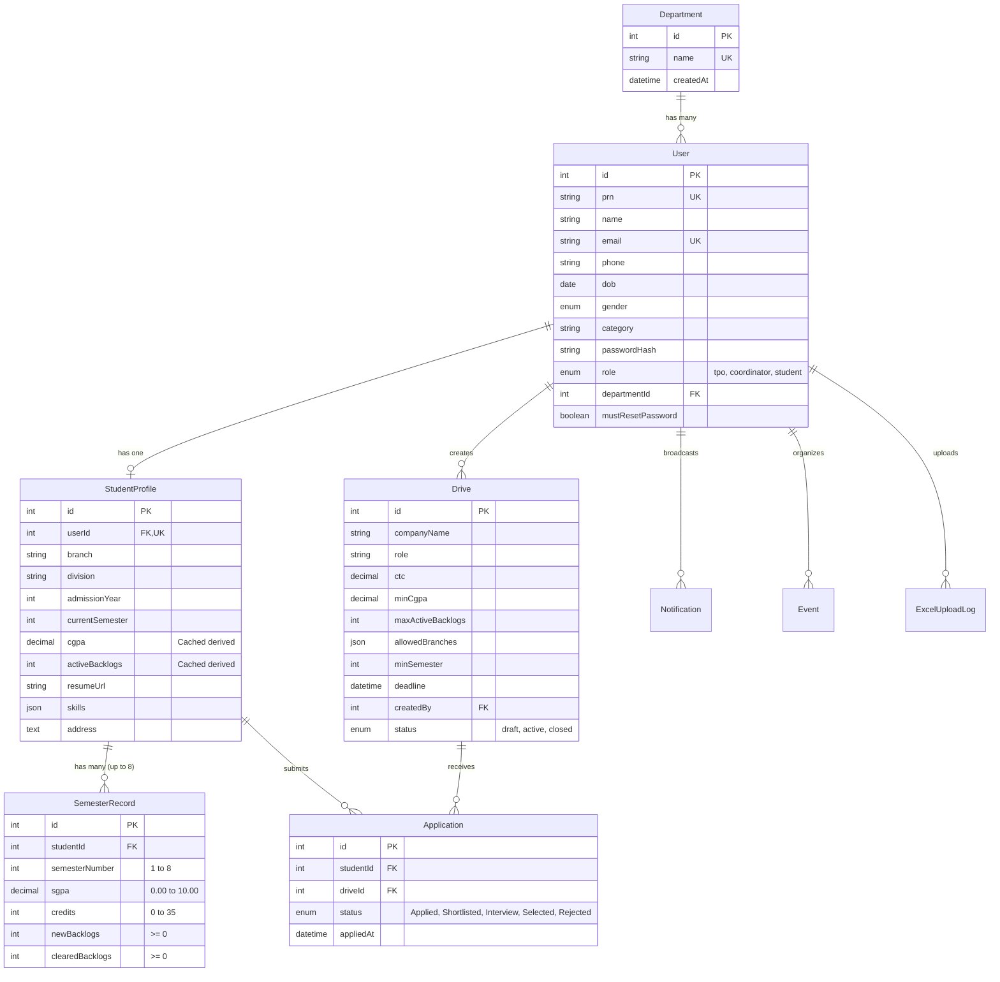

# PlaceTrack — Placement and Training Management System (RCPIT)
### Comprehensive Project Specification, Architecture & Implementation Blueprint

---

## 1. Executive Summary & Vision

**PlaceTrack** is a centralized, role-based, enterprise-grade Placement and Training Management Web Application custom-designed for **R.C. Patel Institute of Technology (RCPIT), Shirpur**.

The system transforms the traditional, fragmented, spreadsheet-heavy campus recruitment workflow into an automated, auditable, and high-performance digital ecosystem. It connects all three primary stakeholders in the placement ecosystem:
1. **Main T&P Officer (Super Admin / College-level TPO)**
2. **Department Placement Coordinators (Branch-level admins)**
3. **Students (Undergraduate candidates across all engineering branches)**

```
+-----------------------------------------------------------------------------+
|                                  PlaceTrack                                 |
|               Placement & Training Management System (RCPIT)                |
+-----------------------------------------------------------------------------+
                                      |
         +----------------------------+----------------------------+
         |                                                         |
         v                                                         v
+-------------------+                                     +-------------------+
|  Main T&P Officer |                                     |    Department     |
|   (Super Admin)   |                                     |    Coordinator    |
+---------+---------+                                     +---------+---------+
          |                                                         |
          | Creates drives, college analytics, accounts             | Scoped branch
          |                                                         | management
          +----------------------------+----------------------------+
                                       |
                                       v
                             +-------------------+
                             |      Student      |
                             |   (PRN Logins)    |
                             +-------------------+
                               Applied Drives, 
                              Academic History,
                               Resumes & Alerts
```

---

## 2. Problem Statement & Real-World Context

### The Existing Manual Workflow
At RCPIT Shirpur, campus placements previously relied on hundreds of decentralized Excel spreadsheets managed across different departments (Computer, IT, AI&DS, E&TC, Mechanical, Civil, Electrical). When a recruiter visits campus with strict criteria (e.g., *CGPA $\ge 7.5$, 0 active backlogs, open only to Comp/IT/AI&DS, 7th semester students*):
- **Manual Filtering Bottlenecks:** TPO coordinators manually cross-check multiple spreadsheet tabs containing thousands of student records.
- **Backlog Inaccuracies:** Spreadsheets often fail to distinguish between *historical backlogs* (failed subjects that have since been cleared) and *active uncleared backlogs*, leading to unfair disqualification or illegal placement submissions.
- **Manual CGPA Calculation Errors:** Stale, hand-calculated CGPAs in spreadsheets frequently deviate from credit-weighted formulas.
- **Fragmented Communication:** Drive notifications, interview schedules, and shortlists were sent across unofficial WhatsApp groups or scattered emails, resulting in missed deadlines and untracked communication.
- **Lack of Centralized Audit Trail:** No single source of truth existed for college-level placement reporting, branch-wise statistical trends, or company-wise conversion rates.

### The PlaceTrack Solution
PlaceTrack replaces manual spreadsheets with a normalized database, automated credit-weighted CGPA and stateful backlog engines, instant eligibility matching, transactional Excel ingestion, resume hosting, and automated email notifications.

---

## 3. Technology Stack

| Layer | Technology | Purpose / Justification |
|---|---|---|
| **Frontend** | React.js, Modern CSS & Tailwind | Interactive, responsive dashboards for TPO, Coordinators, and Students |
| **Backend** | Node.js, Express.js | High-concurrency RESTful API service with modular architecture |
| **Database** | MySQL (Relational DB) | ACID-compliant storage for relational academic and placement records |
| **ORM** | Sequelize ORM | Schema migrations, transactions, validation, and data modeling |
| **Authentication** | JWT (JSON Web Tokens) & bcrypt | Stateless token auth with role enforcement & mandatory password resets |
| **File Storage** | Cloudinary API | Cloud storage and CDN delivery for student PDF resumes |
| **Email Service** | Nodemailer (Gmail SMTP / SendGrid) | Automated transactional emails (status changes, drive notices) |
| **Excel Ingestion** | ExcelJS / xlsx | Robust multi-field parsing and downloadable schema templates |
| **Report Generation** | pdf-lib / Puppeteer | Dynamic generation of PDF placement summaries and student transcripts |
| **Testing** | Jest, Supertest | Automated unit testing for calculation engines and integration tests |
| **Security & Logging**| Helmet, express-rate-limit, Winston | Rate limiting, HTTP header protection, and structured log tracking |
| **Deployment** | Railway | Cloud hosting for Express backend and managed MySQL database |

---

## 4. User Roles & Permission Matrix

```
+---------------------------------------------------+-----+-------------+---------+
| Feature / Action                                  | TPO | Coordinator | Student |
+---------------------------------------------------+-----+-------------+---------+
| Manage Department Master Data                     |  ✓  |      ✗      |    ✗    |
| Create & Manage Coordinator Accounts              |  ✓  |      ✗      |    ✗    |
| College-Wide Student Bulk Excel Upload            |  ✓  |      ✗      |    ✗    |
| Department-Scoped Student Bulk Excel Upload       |  ✓  |      ✓      |    ✗    |
| Create & Publish Placement Drives                 |  ✓  |      ✗      |    ✗    |
| View Auto-Filtered Eligible Candidate Lists       |  ✓  |  ✓ (Branch) |    ✗    |
| Update Application Round Status                   |  ✓  |  ✓ (Branch) |    ✗    |
| View College-Wide Analytics & Export PDF Reports  |  ✓  |      ✗      |    ✗    |
| View Department-Wise Analytics                    |  ✓  |      ✓      |    ✗    |
| Broadcast College/Dept Training Events            |  ✓  |  ✓ (Dept)   |    ✗    |
| View Self Academic History (Sem 1 to 8 Breakdown) |  ✓  |  ✓ (Dept)   |    ✓    |
| Apply to Eligible Placement Drives                |  ✗  |      ✗      |    ✓    |
| Upload / Replace Cloudinary Resume                |  ✗  |      ✗      |    ✓    |
| Track Personal Application Stages                 |  ✗  |      ✗      |    ✓    |
+---------------------------------------------------+-----+-------------+---------+
```

---

## 5. Normalized Database Architecture (3NF)

PlaceTrack strictly rejects the denormalized pattern of storing 8 semester grades as flat columns (`sem1_sgpa`, `sem2_sgpa`, etc.) on the student table. Instead, it adopts a **Normalized 3rd Normal Form (3NF)** relational design.



### Key Schema Design Decisions
1. **Separation of Authentication and Profile:** `User` handles credentials, roles, and basic demographics. `StudentProfile` stores placement-specific information and cached academic metrics.
2. **Normalized `SemesterRecord` Table:** Each semester is an independent tuple linked to `StudentProfile`. A 2nd-year student has exactly 2 or 3 records, preventing sparse null columns.
3. **Compound Unique Constraint:** `(studentId, semesterNumber)` enforces one record per semester per student.
4. **Performance Caching on `StudentProfile`:** `cgpa` and `activeBacklogs` are cached directly on `StudentProfile`. Drive eligibility queries run instantaneous `WHERE cgpa >= 7.5 AND activeBacklogs = 0` queries without performing expensive, table-locking `JOIN + SUM + AVG` aggregations across thousands of semester rows.

---

## 6. Core Business Logic & Calculation Engines

### 6.1 Credit-Weighted CGPA Engine
University grades cannot be averaged via a simple arithmetic mean. Course semesters have varying credit weights. PlaceTrack implements credit-weighted calculation:

$$\text{CGPA} = \frac{\sum_{i=1}^{k} (\text{SGPA}_i \times \text{Credits}_i)}{\sum_{i=1}^{k} \text{Credits}_i}$$

*Where $k$ is the number of completed semesters with valid SGPA.* If credit data is not provided, the engine gracefully falls back to the arithmetic mean of valid SGPAs.

### 6.2 Stateful Backlog Engine
A student may fail 2 subjects in Semester 2 (`newBacklogs = 2`), fail 1 subject in Semester 3 (`newBacklogs = 1`), and clear 2 backlogs during Semester 4 exams (`clearedBacklogs = 2`).

$$\text{Active Backlogs} = \max\left(0, \sum_{i=1}^{k} (\text{New Backlogs}_i - \text{Cleared Backlogs}_i)\right)$$

*Result:* The student's active backlog count is accurately computed as **1**, preventing false disqualification under "no active backlogs" criteria.

### 6.3 Automated Recalculation Trigger
Whenever a student's semester marks are created, corrected, or bulk-ingested via delta uploads, `recalculateStudentAcademics(studentId)` automatically recalculates both values inside the transaction and syncs `StudentProfile.cgpa` and `StudentProfile.activeBacklogs`.

---

## 7. Bulk Excel Ingestion Pipeline & Data Contract

To guarantee data safety and prevent database corruption from malformed spreadsheets, PlaceTrack implements a **strict 44-column contract**:

```
[ Excel Upload File (.xlsx) ]
             |
             v
[ 1. Multer In-Memory Stream ]
             |
             v
[ 2. Header Contract Validation ] ---> (Reject file if columns do not match exact schema)
             |
             v
[ 3. Row-by-Row Parser & Validator ]
             |
             v
[ 4. Per-Student Transaction ]
   ├── Upsert User (PRN, hashed password, role='student')
   ├── Upsert StudentProfile
   ├── Upsert SemesterRecords (1..8)
   └── Run recalculateStudentAcademics()
             |
             v
[ 5. ExcelUploadLog Audit Record ]
   └── Store Total Rows, Success Count, Error Count & JSON Error Details
```

### 44-Column Specification Structure
- **12 Basic Info Fields:** `PRN`, `Name`, `Email`, `Phone`, `DOB`, `Gender`, `Category`, `Branch`, `Division`, `AdmissionYear`, `CurrentSemester`, `Address`.
- **32 Academic Fields (8 Semesters $\times$ 4 Fields):** For $n \in \{1 \dots 8\}$:
  - `SEM{n}_SGPA` (Decimal 0.00 to 10.00)
  - `SEM{n}_CREDITS` (Integer 0 to 35)
  - `SEM{n}_NEW_BACKLOGS` (Integer $\ge 0$)
  - `SEM{n}_CLEARED_BACKLOGS` (Integer $\ge 0$)

### Delta & Incremental Semester Uploads
When university exam results for a new semester (e.g., Semester 6) are published:
- The TPO/Coordinator uploads an Excel sheet containing student PRNs and the new semester data.
- The system recognizes existing PRNs, updates or inserts the specific semester records, and recomputes the students' cumulative CGPA and active backlogs without wiping past history.

---

## 8. End-to-End Placement Drive Workflow

```
+------------------+     +------------------------+     +----------------------+
| 1. Create Drive  | --> | 2. Eligibility Filter  | --> | 3. Student Applies   |
| (TPO sets CTC,   |     | (Instant matching on   |     | (Double validation   |
| CGPA, branches)  |     |  cached profile stats) |     |  on submission)      |
+------------------+     +------------------------+     +----------------------+
                                                                   |
                                                                   v
+------------------+     +------------------------+     +----------------------+
| 6. Final Offer & | <-- | 5. Bulk Status Updates | <-- | 4. Round Progression |
| Email Alert      |     | (TPO / Coordinator     |     | (Applied -> Shortlist|
| (Nodemailer)     |     |  moves candidates)     |     |  -> Interview -> ...) |
+------------------+     +------------------------+     +----------------------+
```

1. **Drive Creation:** TPO creates a company drive specifying criteria (e.g., Min CGPA 7.0, Max Backlogs 0, Branches: Comp, IT, Minimum Semester 7, Deadline).
2. **Automated Shortlist & Discovery:** Eligible students see the drive on their personalized portal with an "Apply" button. Ineligible students see a clear breakdown of which criteria they did not meet.
3. **Application & Lock:** Student submits application with their Cloudinary-hosted resume. The backend re-validates eligibility on the server side to prevent unauthorized bypasses.
4. **Hiring Stages & Communication:** Department coordinators and TPO review applicants, conduct rounds, update candidate statuses (Shortlisted $\to$ Technical Interview $\to$ Selected $\to$ Rejected), and trigger automated email alerts.

---

## 9. Training, Industry Programs & Analytics

### 9.1 Training & Skill Development Events
- TPO and Coordinators schedule mock interviews, coding bootcamps, resume-building workshops, and expert guest lectures.
- Events can be broadcast college-wide or targeted to specific branches.

### 9.2 Real-Time Analytics & Reporting
- **TPO Dashboard:** Real-time metrics on total placement percentage, branch-wise placed vs unplaced ratio, average/highest CTC packages, and top recruiting companies.
- **Department Dashboard:** Granular branch statistics and student-level placement tracking.
- **PDF Report Generation:** One-click generation of professional placement summary reports for college accreditation (NAAC/NBA).

---

## 10. Security, Reliability & Engineering Best Practices

- **Role-Based Access Control (RBAC):** Middleware verifies JWT tokens and enforces role restrictions on every API endpoint.
- **Mandatory First-Login Password Reset:** Bulk-created student accounts are initialized with default credentials and a `mustResetPassword: true` flag, forcing students to establish secure passwords on first sign-in.
- **Header & Payload Validation:** Express-validator and strict header checks eliminate malformed payloads and injection attempts.
- **Defensive API Architecture:** Standardized JSON response envelope across all endpoints:
  ```json
  {
    "success": true,
    "data": { ... },
    "message": "Operation completed successfully"
  }
  ```
  ```json
  {
    "success": false,
    "error": {
      "code": "VALIDATION_ERROR",
      "message": "Detailed description of error"
    }
  }
  ```
- **Winston Structured Logging & Error Handling:** Centralized logging with severity levels (`info`, `warn`, `error`) and structured stack traces.

---

## 11. Implementation Roadmap & Current Status

```
[ Phase 0: Setup ]                   [ DONE ] -> Scaffold, Express, Env
[ Phase 1: Database Setup ]          [ DONE ] -> MySQL, Sequelize, Migrations
[ Phase 2: Excel Data Contract ]     [ DONE ] -> Frozen 44-col spec, Map, Generator
[ Phase 3: Core Domain Models ]      [ DONE ] -> Dept, User, StudentProfile, SemRecord
[ Phase 4: Academic Engine ]         [ DONE ] -> Credit-weighted CGPA, Backlogs, Tests
--------------------------------------------------------------------------------------
[ Phase 5: Authentication (JWT) ]    [ IN PROGRESS / NEXT ]
[ Phase 6: Dept & Coordinator Mgmt ] [ QUEUED ]
[ Phase 7: Bulk Excel Ingestion ]    [ QUEUED ]
[ Phase 8: Student Profile & Resume] [ QUEUED ]
[ Phase 9: Drives & Eligibility ]    [ QUEUED ]
[ Phase 10: Application Pipeline ]   [ QUEUED ]
[ Phase 11: Email & Notifications ]  [ QUEUED ]
[ Phase 12: Events & Training ]      [ QUEUED ]
[ Phase 13: Analytics & PDF Reports] [ QUEUED ]
[ Phase 14: Hardening & Testing ]    [ QUEUED ]
```

---

## 12. Technical Viva & Project Defense Highlights

When explaining or defending this project in academic vivas or technical interviews, highlight these core architectural advantages:

1. **Why 3NF Normalization over Flat Columns?**
   *Answer:* A flat table with `sem1_sgpa` through `sem8_sgpa` is denormalized and sparse for juniors. Normalizing into `SemesterRecord` cleanly accommodates 1st through 4th-year students, preserves data integrity, and enables semester-over-semester performance trend analysis.
2. **Why Cached Academic Aggregates (`cgpa`, `activeBacklogs`)?**
   *Answer:* Computing credit-weighted CGPA and active backlogs on-the-fly for 1,000+ students during every company eligibility search creates query bottlenecks. Precomputing during Excel ingestion and caching on `StudentProfile` enables sub-millisecond eligibility queries.
3. **How does the system prevent Excel Ingestion Failures?**
   *Answer:* The pipeline enforces a frozen column contract (`excelColumnMap.js`), verifies headers before reading rows, runs validations per student, and commits changes inside database transactions with row-level error logging.
4. **How are Backlogs accurately tracked?**
   *Answer:* Backlogs are treated as stateful events (`newBacklogs` and `clearedBacklogs` per semester) rather than a single static number, ensuring students who have cleared previous backlogs are not wrongfully disqualified.

---
*Document prepared for PlaceTrack (Placement & Training Management System, RCPIT Shirpur).*
